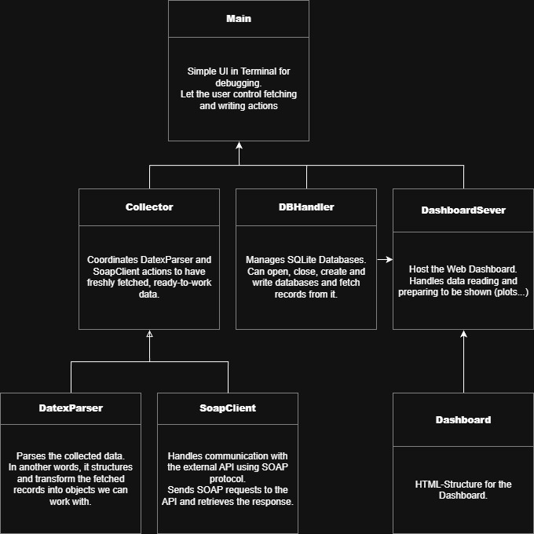

## 1.	Introduction
The objective of the first phase of the SwissSpeed project was the development of an autonomous system hosted on a virtual machine (VM) for real-time traffic monitoring. The system was designed to automatically retrieve data via a specialized API, store it in a structured database, and visualize the results through a dynamic web dashboard. High importance was placed on "zero-touch" operation, ensuring the entire pipeline initializes automatically upon booting the VM. To achieve this, VMware Workstation and Ubuntu 25.10 were utilized as the primary environment. Programming was mainly conducted using Python, supplemented by XML for data parsing and HTML for the dashboard interface.

## 2.	Development Process and Evolution
The current state of the system was reached through a structured, multi-stage development process. Initially, a fresh Ubuntu environment was provisioned, followed by the configuration of a Python virtual environment (venv). This isolation was necessary to ensure that project-specific dependencies would remain independent of the system’s global packages, thereby guaranteeing the portability of the VM.
Once the environment was stable, the focus shifted to data acquisition. Early iterations involved simple scripts to test the connectivity with the external SOAP API. This was followed by the design of the database schema in SQLite, which was chosen for its lightweight and serverless nature. The software architecture then evolved from basic procedural scripts into a robust Object-Oriented (OO) structure.
Initially, a command-line interface (CLI) version of the "Main" program was developed to facilitate debugging and manual control of the fetching process. Once the backend logic was verified, the Dashboard class was integrated to replace the CLI with a web-based visualization tool. Finally, the system was moved from manual execution to a fully automated service managed by systemd, ensuring that the software lifecycle is maintained without user intervention from the moment the operating system starts.

## 3.	Logical Architecture and Class Integration

The provided diagram illustrates the modular design of the backend. The Main class serves as the entry point, orchestrating the Collector and the DBHandler. The Collector acts as a coordinator, utilizing the SoapClient to handle the communication protocol and the DatexParser to transform the raw XML records into workable Python objects. These objects are then passed to the DBHandler for persistence.
Regarding the integration of the DashboardServer, it should be positioned as a parallel branch under Main. While the Collector is responsible for the "Write" operations (Ingestion), the DashboardServer is responsible for the "Read" operations. It connects directly to the DBHandler to fetch the records stored by the collector and serves them to the user via a Flask-hosted web page. This separation ensures that the data collection process and the user interface do not interfere with one another, a key principle in distributed and concurrent computing.

## 4.	Technical Stack and Dependencies
The project was built using a specific set of libraries, each chosen for its efficiency in handling distributed data tasks. All dependencies were managed within a virtual environment to ensure system stability.
•	Requests: This library was fundamental for handling all communication with the external API. It was used to send HTTP POST requests containing the SOAP envelopes to the server.
•	Pandas: Once the raw data was parsed, Pandas was employed for data manipulation. It provided the necessary tools to clean, sort, and structure the traffic measurements into DataFrames, which are optimized for high-performance analysis.
•	Plotly: For the visualization layer, Plotly was integrated to generate interactive graphs. Unlike static libraries, Plotly allowed for the creation of dynamic charts that enable users to zoom and hover over specific data points.
•	Flask: The web hosting was managed by Flask, a lightweight WSGI web application framework. It served as the bridge between the Python backend and the browser, handling the routing and the rendering of the HTML templates.
•	SQLite3: This standard library provided the interface for the database. It was used to execute all SQL queries for both the storage of new records by the Collector and the retrieval of historical data for the Dashboard.

## 5.	Automation and Service Management
To meet the requirement of automatic execution at startup, system has been choosen. A custom service has been created (traffic_dashboard.service) that manages the Python lifecycle.
Impact: If the script crashes or the VM restarts, systemd automatically re-initializes the service.
To complete the user experience, an autostart script triggers the browser upon user login to display the dashboard immediately.

## 6.	Data Source and Representation
The system consumes data from opentransportdata.swiss, specifically the "Road Traffic Counters" feed. These measurements represent vehicle counts and average speeds at fixed sensor locations across the Swiss road network, updated at one-minute intervals.
The data is retrieved in the European DATEX II (XML) standard.
For the first plot, a chart shows the volume of vehicles, categorized by type (Heavy vs. Light vehicles), measured by the different stations over Switzerland.
For the second one, a chart displays the average speeds for each vehicle category.

## 7.	User Instructions & Administration
The SwissSpeed tool is designed for autonomous operation.
Simply power on the VM. After the desktop loads, the dashboard will open automatically in the browser at http://localhost:5000. The data refreshes dynamically as new records are written to the database.
For administrative tasks, the service can be managed via the terminal:
Check status: sudo systemctl status traffic_dashboard.service
Restart: sudo systemctl restart traffic_dashboard.service

## 8.	Access Credentials
Username: Theobias
Password: Theobias

## 9.	Task Allocation
Théo Maratrey: Responsible for the realization and documentation of this first Hands-On.
Tobias Roth: Responsible for the upcoming second Hands-On.
GitHub was used for this project to facilitate data sharing, track development, and, consequently, assist us with documentation.
https://github.com/Aiguuu/SwissSpeed

