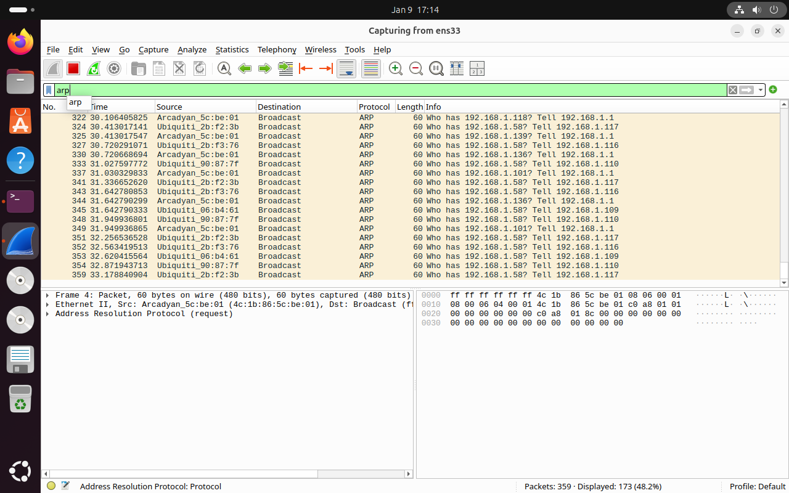
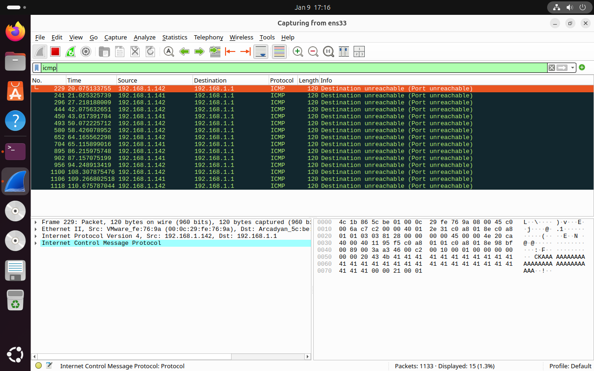
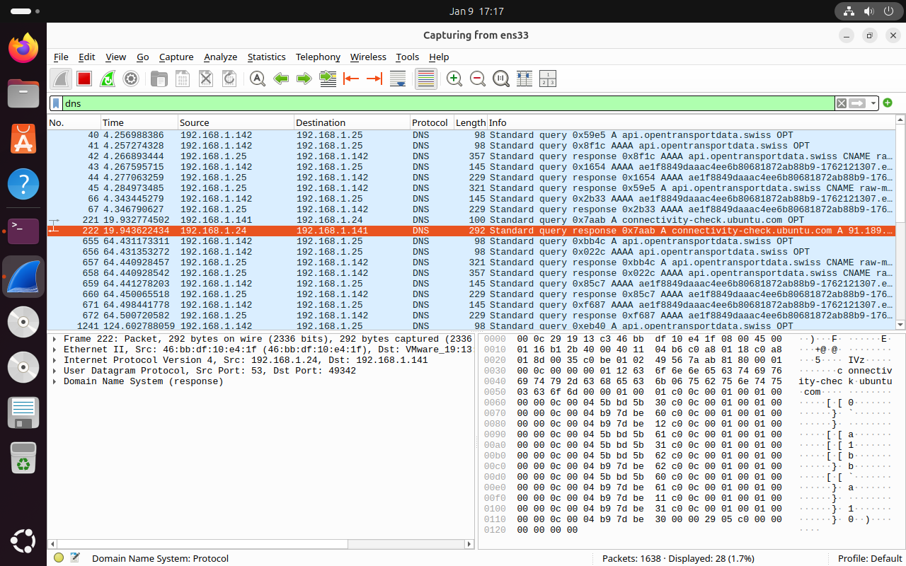
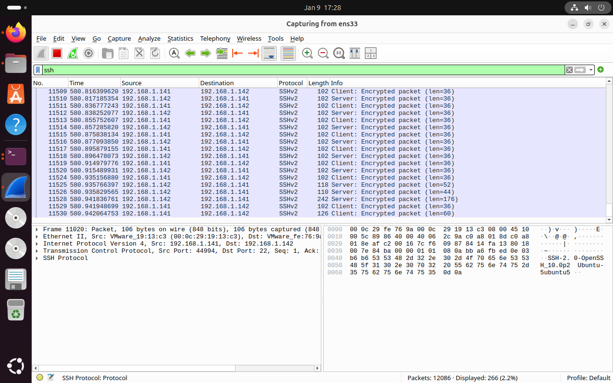
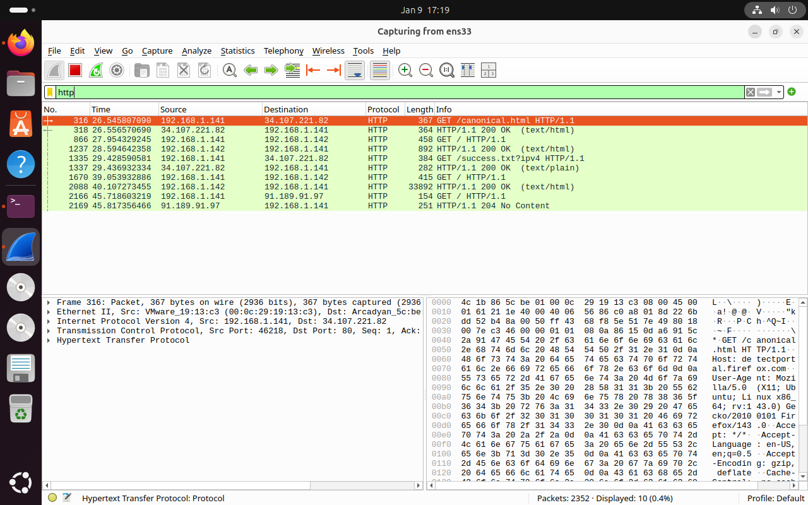

## 1.	Introduction
Project 2 sets up two virtual machines: a server that hosts a traffic dashboard based on the database from Project 1, and a client that accesses the dashboard over the network. The focus is on dependable, automated operation, straightforward hostname-based access, and a concise network analysis using Wireshark framed by the OSI model.

## 2.	What was adapted from the first Project?
From the first project, we reused the core architecture and modules to accelerate delivery and maintain consistency:
- Collector, SoapClient, and DatexParser: retained for data fetching and XML (DATEX II) parsing.
- DBHandler and SQLite storage: same lightweight persistence with a composite key to prevent duplicates.
- Flask-based DashboardServer: web UI served locally, refreshed from the database.
- VM setup and venv: identical isolation and bootstrapping approach.
The second project focuses on stabilizing and packaging these components rather than redesigning them.

## 3.	What had to be changed from the first Project

Changes from the first project include:
- Separation of concerns: `Collector` (write path) and `DashboardServer` (read path) run independently to avoid contention.
- Paths and service configuration: updated working directory and `ExecStart` to the Part2 layout.
- Templating: moved dashboard HTML into Flask templates for cleaner rendering and routing.
Main remains the orchestrator, coordinating `Collector`/`DBHandler` for ingestion and `DashboardServer` for visualization.

## 4.	SQL-Schema
SQLite is used for persistence. The single table `SwissSpeed` stores per-station measurements with a composite uniqueness constraint to avoid duplicates:

```
CREATE TABLE IF NOT EXISTS SwissSpeed (
	Location    TEXT    NOT NULL,
	Timestamp   TEXT    NOT NULL,
	LightFlow   INTEGER,
	HeavyFlow   INTEGER,
	LightSpeed  INTEGER,
	HeavySpeed  INTEGER,
	Error       TEXT,
	UNIQUE (Location, Timestamp)
);
```

- Key: `(Location, Timestamp)` acts as the candidate key via `UNIQUE`.
- Normalization: 1NF and 2NF are satisfied; non-key attributes depend on the full composite key. No transitive dependencies are expressed, so it adheres to 3NF and likely BCNF under typical domain assumptions.

## 5.	Packet analysis

- ### ARP: Adress Resolution Protocol 
    

    ARP is used to assign an IP-adress to a MAC-adress. 
    This happens in the Data Link Layer (2) because ARP uses MAC_adresses directly.
    This Protocol is used when a client pings the server.
- ### ICMP: Internet Control Message Protocol
    

    ICMP is used for Error and status updates in the IP-Network. This happens in the Network Layer (3).This Protocol is used when a client pings the server.
- ### DNS: Domain Name System

    
    DNS is used to translate Hostnames into IP-adresses. This happens in the Application Layer (7). This Protocol is used when a client pings the server or needs access to said server.

- ### SSH: Secure Shell

    
    SSH enables safe, encrypted and remote access to servers. This also happens in the Application Layer (7). This protocol is used when the client needs direct and/ or encrypted access to the server.

- ### HTTP(S): Hyper Text Transfer Protocol (Secure)

    
    HTTP is used to transmit websites and API data.
    HTTPS is the same with the added TLS security protocol. This happens on the Application Layer (7). This Protocol is used as soon as the client accesses the Dashboard.

## 6.	Which Data is visible or encrypted and why?
- Visible: Aggregated traffic measurements (counts and average speeds) per station; no personal or vehicle-identifying data.
- In transit: Retrieved over HTTPS from opentransportdata.swiss, ensuring encryption on the wire.
- At rest: Stored locally in SQLite on the VM; not encrypted by default, acceptable for public, non-PII datasets within a controlled VM.
- Dashboard: Displays station-level aggregates only; no sensitive fields are exposed.

## 7.	Why do Hostnames work reliably without IP's?
Hostnames remain stable and resolvable even when IPs change:
- `localhost` reliably points to the local machine for the dashboard.
- External endpoints use provider-managed DNS; clients resolve current IPs via DNS lookups, avoiding hardcoded addresses.
- System services reference hostnames, improving portability across networks and environments.

## 8.	How was the service integrated in systemd?
The unit file `traffic_dashboard.service` manages the app lifecycle:

```
[Unit]
Description=Traffic Monitoring Dashboard Service
After=network.target

[Service]
User=theobias
WorkingDirectory=/home/theobias/SwissSpeed/Part2
ExecStart= /home/theobias/test/test_env/bin/python3 /home/theobias/SwissSpeed/Part2/Main.py
Restart=always
RestartSec=5

[Install]
WantedBy=multi-user.target
```

Install and enable:
- `sudo cp traffic_dashboard.service /etc/systemd/system/`
- `sudo systemctl daemon-reload`
- `sudo systemctl enable --now traffic_dashboard.service`

## 9.	Access Credentials
- Username: theobias
- Password: theobias
Note: lowercase "t" unlike in the first project.

## 10.	Task Allocation
Théo Maratrey: Responsible for the realization and documentation of first Hands-On.
Tobias Roth: Responsible for the second Hands-On.
GitHub was used for this project to facilitate data sharing, track development, and, consequently, assist us with documentation.
https://github.com/Aiguuu/SwissSpeed


